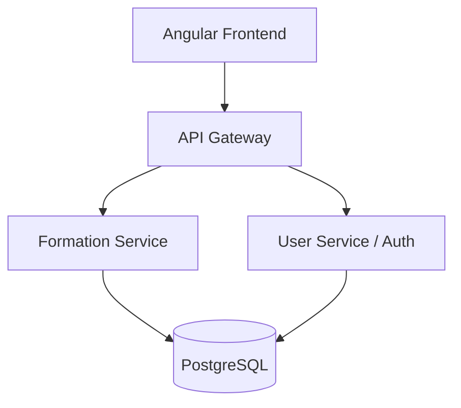

# Esprit-PI-Classe-Année-CertifyPro

<p align="center">
  
  
  
  
</p>

## 🎓 Academic Context

- **University:** ESPRIT (École Supérieure Privée d'Ingénierie et de Technologies)
- **Module:** Projet Intégré (PI)
- **Sprint:** Sprint 01 - Core Module & Architecture Setup
- **Academic Year:** 2024 - 2025 (Placeholder)
- **Class:** [CLASSE_PLACEHOLDER]

## 🌟 Project Overview: CertifyPro

**CertifyPro** is a premium, enterprise-grade learning and certification platform designed to bridge the gap between academic knowledge and professional mastery. The platform provides a seamless experience for trainers to curate expert-led content and for students to advance their careers through verified certifications.

### 🎯 Sprint 01 Objectives
- [x] **Complete CRUD for Trainings:** Full management of training resources with support for multimedia (PDF/Video).
- [x] **Functional Pagination:** Optimized data retrieval for training lists using Spring Data JPA.
- [x] **Advanced Form Validation (Contrôle de Saisie):** Robust feedback system for all user inputs.
- [x] **Microservices Architecture:** Scalable backend foundation with integrated services.
- [x] **Premium UI/UX:** Modern, responsive design with a focus on user experience.

## 🏗️ Architecture

CertifyPro follows a modern **Microservices Architecture** to ensure high availability, scalability, and independent deployment of core business functions.



## 🛠️ Technology Stack

| Layer | Technologies |
| :--- | :--- |
| **Frontend** | Angular, TypeScript, RxJS, Bootstrap (Premium UI) |
| **Backend** | Spring Boot, Spring Data JPA, Spring Security (JWT) |
| **Database** | PostgreSQL |
| **Tools** | Maven, Git, GitHub |

## 🚀 Getting Started

### Prerequisites

- Java 17+
- Node.js 18+
- PostgreSQL
- Maven

### Backend Setup

1. Create a database named `userdb` in PostgreSQL.
2. Configure `.env` (copy from `.env.example`).
3. Run the user service:
   ```bash
   cd backend/services/user-service
   mvn spring-boot:run
   ```

### Frontend Setup

1. Install dependencies:
   ```bash
   cd frontend
   npm install
   ```
2. Start the development server:
   ```bash
   ng serve
   ```
3. Access the portal at `http://localhost:4200`.

## 👥 Team Members
- **[NOM_PRENOM_1]**
- **[NOM_PRENOM_2]**
- **[NOM_PRENOM_3]**

---
*Developed with ❤️ as part of the PI Module at ESPRIT.*
