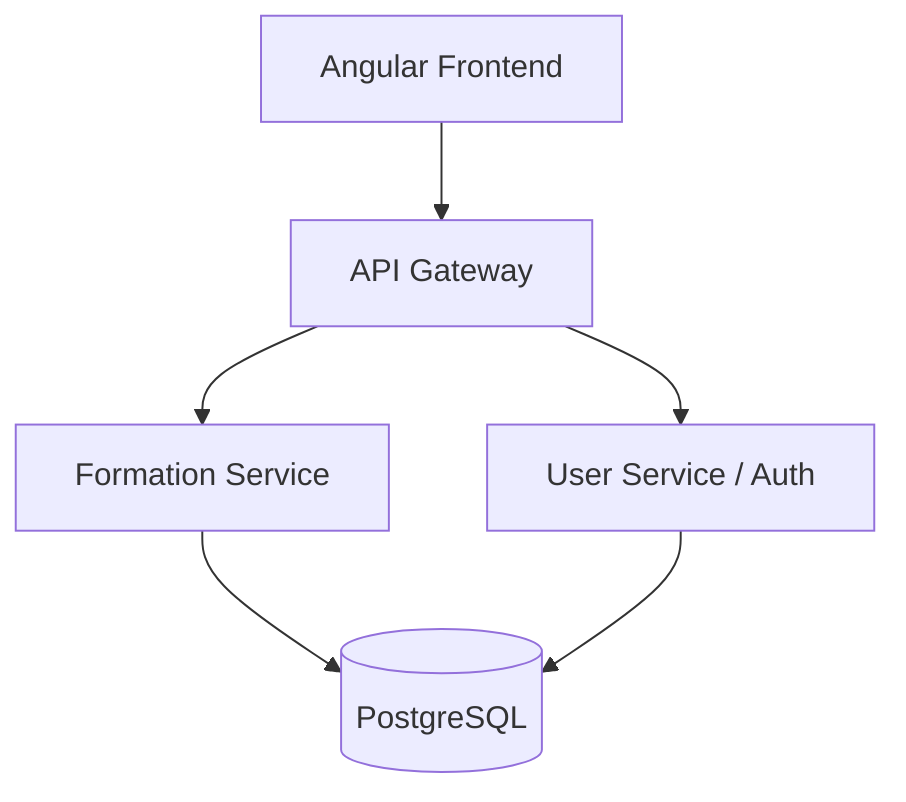

<<<<<<< HEAD
# 🎓 CertifyPro – Learning & Certification Platform

A modern learning and certification platform built with a microservices architecture.

## 📌 Overview

CertifyPro is a learning and certification platform that enables learners to access trainings, participate in events, interact through forums, communicate with trainers, and obtain certifications.

The platform is designed using a microservices architecture to ensure scalability, modularity, and maintainability.

*This project was developed as part of the PIDEV – 3rd Year Engineering Program at Esprit School of Engineering – Tunisia Academic Year 2025–2026.*

---

## 🚀 Features

### 🔐 User Management
- User authentication & authorization (JWT)
- Email verification & password reset

### 📚 Learning & Training
- Training management system
- E-commerce module for trainings
- Certification management

### 📅 Events & Scheduling
- Event management (workshops, webinars, bootcamps)
- Event registration & personal agenda calendar
- QR Code Event Pass
- Online meeting integration (Zoom / Google Meet / Teams)

### 💬 Communication
- Forum discussions
- Messaging between users
- Notifications and reminders

---

## 🛠 Tech Stack

### Frontend
- **Angular** – Frontend framework
- **TypeScript** – Typed JavaScript
- **HTML / CSS** – Markup and styling
- **Bootstrap** – Responsive design
- **Angular Material** – UI components

### Backend
- **Spring Boot** – Backend framework
- **Spring Security** – Authentication & authorization
- **JWT Authentication** – Secure token-based auth
- **Spring Cloud** – Microservices management
- **RESTful APIs** – Service communication

### Database
- **PostgreSQL** – Relational database

### DevOps & Tools
- **Git** & **GitHub** – Version control
- **Docker** (optional) – Containerization

---

## 🏗 Architecture

The platform follows a **Microservices Architecture**.

### Core Services

| Service | Responsibility |
|---------|----------------|
| **API Gateway** | Central entry point for all client requests |
| **Discovery Server (Eureka)** | Service registration and discovery |
| **User Service** | Authentication, user management and security |
| **Training Service** | Training and course management |
| **Event Service** | Event creation, registration and agenda management |
| **Forum Service** | Community discussions |
| **Messaging Service** | Communication between users |
| **Certification Service** | Certificate generation and management |
| **E-Commerce Service** | Online purchasing of trainings |
| **Notification Service** | Email notifications and reminders |

All services communicate through REST APIs and are registered using **Eureka Service Discovery**.

---

## ⚙️ Project Ecosystem Details

- **Frontend:** Angular (`ng serve` → port **4200**)
- **API entry:** Spring Cloud **Gateway** (port **8080** or **8081**) — routes to microservices
- **Services:** `user-service`, `event-service` (register with **Eureka**)
- **Discovery:** Eureka server (port **8761**)
- **DB:** PostgreSQL (local)

The Angular app calls the gateway only (see `frontend/src/app/core/api/api.config.ts`).

| Service        | Typical port | Role                                      |
|----------------|--------------|-------------------------------------------|
| api-gateway    | 8080/8081    | Single HTTP entry (`/api/users`, `/api/events`, …) |
| discovery-server | 8761       | Service registry                          |
| user-service   | 8883         | Users, auth, roles, trainer-requests      |
| event-service  | 8884         | Events, registrations, reviews          |

---

## 👨‍💻 Contributors

- **Sirine Dahmane**
- **Khalil Houari**
- **Rania Kalai**
- **Mohamed Ali Saadaoui**
- **Nesrine Romdhane**
- **Ammar**

---
=======
# Esprit-PI-Classe-Année-CertifyPro

<p align="center">
  
  
  
  
</p>

## 🎓 Academic Context

- **University:** ESPRIT (École Supérieure Privée d'Ingénierie et de Technologies)
- **Module:** Projet Intégré (PI)
- **Sprint:** Sprint 01 - Core Module & Architecture Setup
- **Academic Year:** 2024 - 2025 (Placeholder)
- **Class:** [CLASSE_PLACEHOLDER]

## 🌟 Project Overview: CertifyPro

**CertifyPro** is a premium, enterprise-grade learning and certification platform designed to bridge the gap between academic knowledge and professional mastery. The platform provides a seamless experience for trainers to curate expert-led content and for students to advance their careers through verified certifications.

### 🎯 Sprint 01 Objectives
- [x] **Complete CRUD for Trainings:** Full management of training resources with support for multimedia (PDF/Video).
- [x] **Functional Pagination:** Optimized data retrieval for training lists using Spring Data JPA.
- [x] **Advanced Form Validation (Contrôle de Saisie):** Robust feedback system for all user inputs.
- [x] **Microservices Architecture:** Scalable backend foundation with integrated services.
- [x] **Premium UI/UX:** Modern, responsive design with a focus on user experience.

## 🏗️ Architecture

CertifyPro follows a modern **Microservices Architecture** to ensure high availability, scalability, and independent deployment of core business functions.



## 🛠️ Technology Stack

| Layer | Technologies |
| :--- | :--- |
| **Frontend** | Angular, TypeScript, RxJS, Bootstrap (Premium UI) |
| **Backend** | Spring Boot, Spring Data JPA, Spring Security (JWT) |
| **Database** | PostgreSQL |
| **Tools** | Maven, Git, GitHub |
>>>>>>> origin/Trainings-Evaluation

## 🚀 Getting Started

### Prerequisites
<<<<<<< HEAD
- Java 17+
- Node.js & npm
- PostgreSQL
- Maven

### Run (Full Stack)

1. **PostgreSQL** — Create DBs: `userdb`, `eventdb`, `forumdb`, `ecommerce_db`.
2. **Eureka** — Start discovery server first.
3. **Microservices** — Start `user-service`, `event-service`, etc. (each registers with Eureka).
4. **Gateway** — Start `api-gateway` on **8080** or **8081**.
5. **Frontend** — `cd frontend && npm install && npx ng serve`.

**API base URL:** `http://localhost:8080` (or `8081`).

---

## 🎓 Academic Context

- **Developed at:** Esprit School of Engineering – Tunisia
- **Program:** PIDEV – 3rd Year Engineering Program
- **Academic Year:** 2025–2026

🙏 **Acknowledgments**
This project was developed as part of the PIDEV course at Esprit School of Engineering – Tunisia. Special thanks to our instructors and supervisors for their guidance throughout this academic project.
=======

- Java 17+
- Node.js 18+
- PostgreSQL
- Maven

### Backend Setup

1. Create a database named `userdb` in PostgreSQL.
2. Configure `.env` (copy from `.env.example`).
3. Run the user service:
   ```bash
   cd backend/services/user-service
   mvn spring-boot:run
   ```

### Frontend Setup

1. Install dependencies:
   ```bash
   cd frontend
   npm install
   ```
2. Start the development server:
   ```bash
   ng serve
   ```
3. Access the portal at `http://localhost:4200`.

## 👥 Team Members
- **[NOM_PRENOM_1]**
- **[NOM_PRENOM_2]**
- **[NOM_PRENOM_3]**

---
*Developed with ❤️ as part of the PI Module at ESPRIT.*
>>>>>>> origin/Trainings-Evaluation
